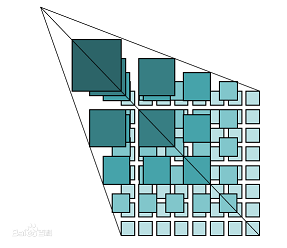
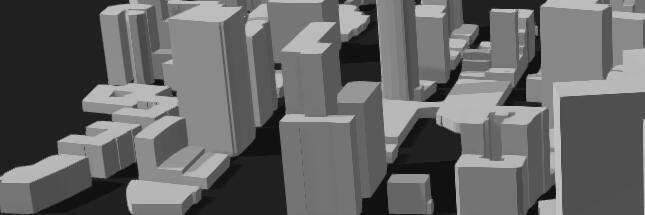

# 概述

## 地图瓦片

瓦片地图金字塔模型是一种多分辨率层次模型，从瓦片金字塔的底层到顶层，分辨率越来越低，但表示的地理范围不变。首先确定地图服务平台所要提供的缩放级别的数量N，把缩放级别最高、地图比例尺最大的地图图片作为金字塔的底层，即第0层，并对其进行分块，从地图图片的左上角开始，从左至右、从上到下进行切割，分割成相同大小(比如256x256像素)的正方形地图瓦片，形成第0层瓦片矩阵;在第0层地图图片的基础上，按每像素分割为2×2个像素的方法生成第1层地图图片，并对其进行分块，分割成与下一层相同大小的正方形地图瓦片，形成第1层瓦片矩阵;采用同样的方法生成第2层瓦片矩阵;…;如此下去，直到第N一1层，构成整个瓦片金字塔。

> 以上引自百度百科

## 栅格瓦片和矢量瓦片

* 栅格瓦片是指瓦片的内容为静态图片，例如png，jpg等。
* 矢量瓦片是指瓦片的内容为矢量数据，包括点，线，面的坐标值和可选的数据属性值，这里有一篇矢量瓦片的[简略介绍文章](../../../ide/guide/basic/vt/)。

| 特点  |  栅格瓦片  | 矢量瓦片 |
|:------------ | -----------| --------|
|易于生产       |  ❌        | ✔     |
|属性数据       |  ❌        | ✔     |
|可以交互       |  ❌        | ✔     |
|支持三维       |  ❌        | ✔     |
|渲染机制       |  简单       | 复杂    |
|实时切片       |  困难       | 容易    |

综上，矢量瓦片相比传统的栅格瓦片，除了渲染机制实现复杂外，拥有很多优点。

## 历史

矢量瓦片格式是由mapbox在2014年开发的，目前最新版本2.1版。

## 矢量瓦片与三维

目前矢量瓦片中存储的是二维数据，但可以通过结合属性数据中的高度值来生成类似下图中的三维建筑白模。

## 服务端实时切片

矢量瓦片中因为存储的矢量数据，相比栅格瓦片能省略服务端的绘制步骤，因此基于空间数据库实时生成矢量瓦片会更加高效方便。

通过服务端实时切片，数据的更新能实时反映在瓦片结果中，降低服务的实时性和数据维护成本。

目前PostGIS数据库增加了 `ST_AsMVT` SQL函数，能将查询结果直接输出为矢量瓦片格式。社区的一些开源服务端提供了基于数据库或文件数据的实时切片功能。

MapTalks解决方案提供了VTS服务端软件，用于亿级数据的矢量瓦片实时切片，您可以在这里获得详细信息。