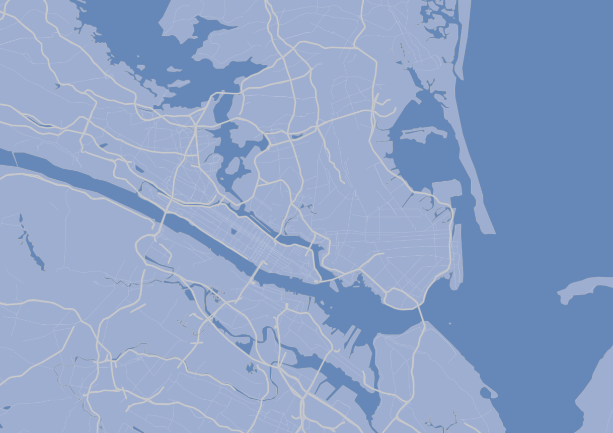
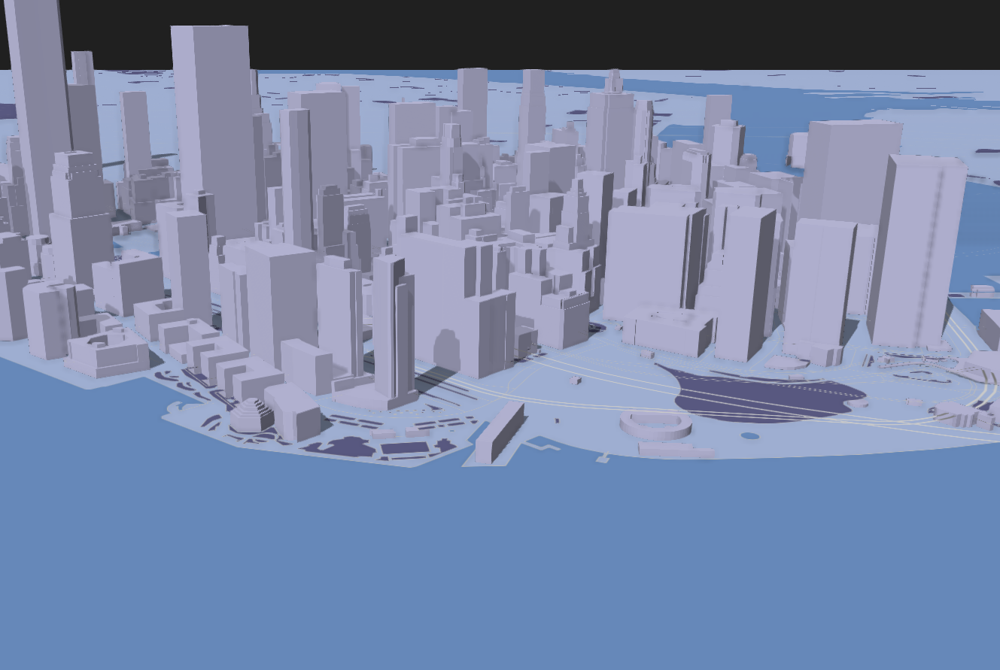
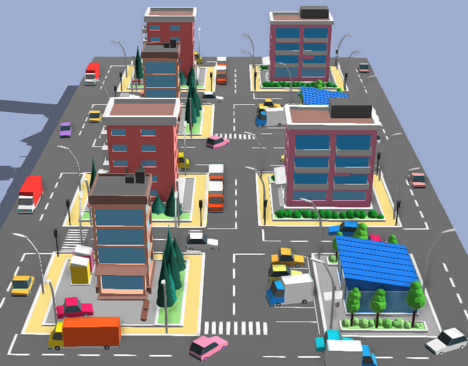
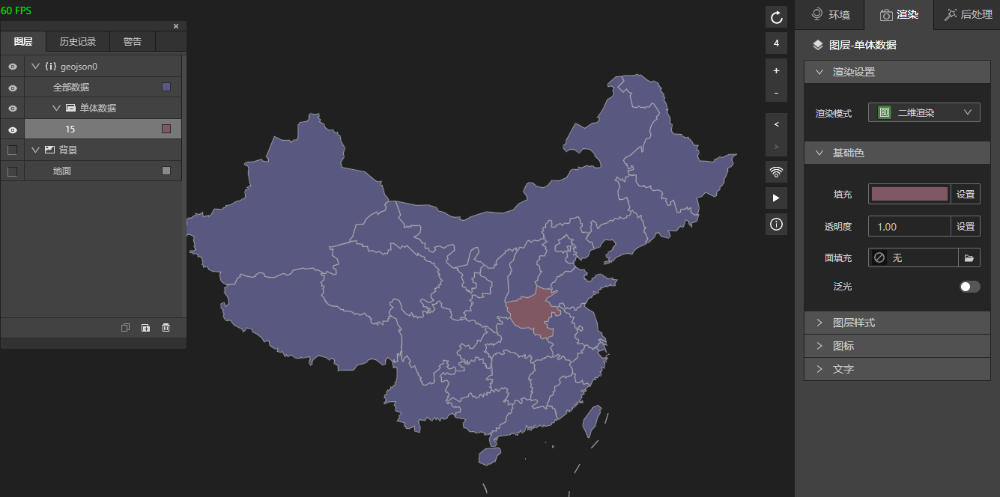
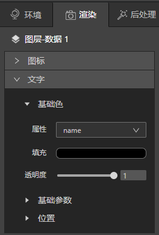

## 如何创建合适的图层

　　现阶段，我们提供了四大图层，矢量瓦片图层， geojson图层，gltf模型图层， 点线面矢量图层。在未来，我们会添加其他图层，敬请期待。

　　每个的效果如下。

  
*<small>矢量瓦片二维渲染</small>*  

  
*<small>矢量瓦片三维渲染</small>*

  
*<small>gltf图层</small>*

  
*<small>geojson图层</small>*

  
*<small>矢量点线面图层</small>*

### 矢量瓦片图层

　　新建图层，默认选中矢量瓦片，勾选您想要设计的数据，比如建筑，水系，如果您暂时忘了添加，也可以后续按图层面板的矢量图层中的添加数据按钮继续添加。

　　调整设置面板的图层样式，开始您的设计。

### geojson图层

　　geojson数据导入后，根据数据点线面进行判断，支持多种渲染模式。它导入后本身是单体数据，您也可以在地图上右键，针对某一块，设置featureStyle。
  

### gltf模型图层

　　创建gltf三维模型，您可以添加新属性，它是给程序过滤模型，来后续通过代码操作用的，如果您确定不需要后续程序控制，可以不用添加属性。

### 点线面矢量图层

　　矢量图层中，您可以选择点线面任一图层类型，也可以添加属性，比如选中点图层，属性名称为"name"，属性类型为"string字符串"，然后在地图上添加一个点，此时弹出编辑框，让您填写name字段的属性值，它就是您在地图上可以显示文字的数据。修改"渲染面板/文字/基础色/属性"为name，即可在地图上显示文字和图标。调整其他属性，比如位置中的y轴偏移，以及图标大小等各种属性，即可得到合适的效果。

### 倾斜摄影图层（开发中）

### 特效图层（开发中）