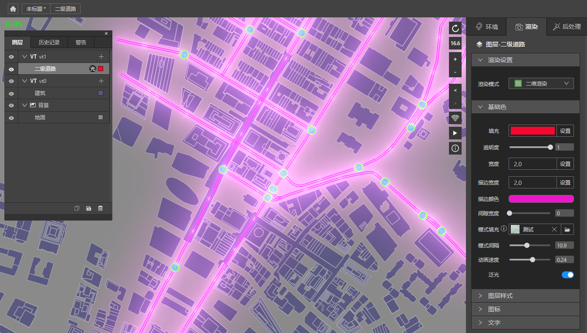
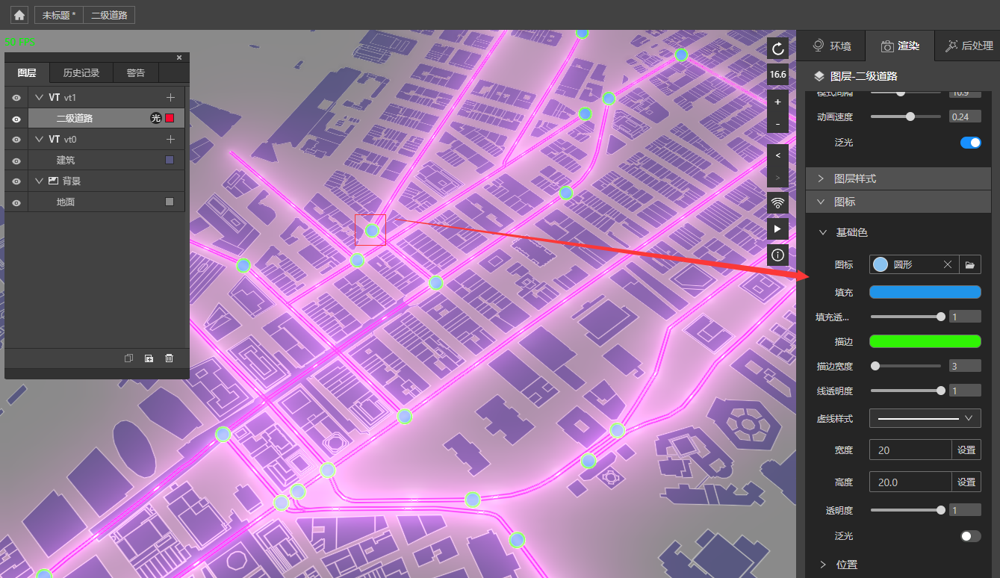
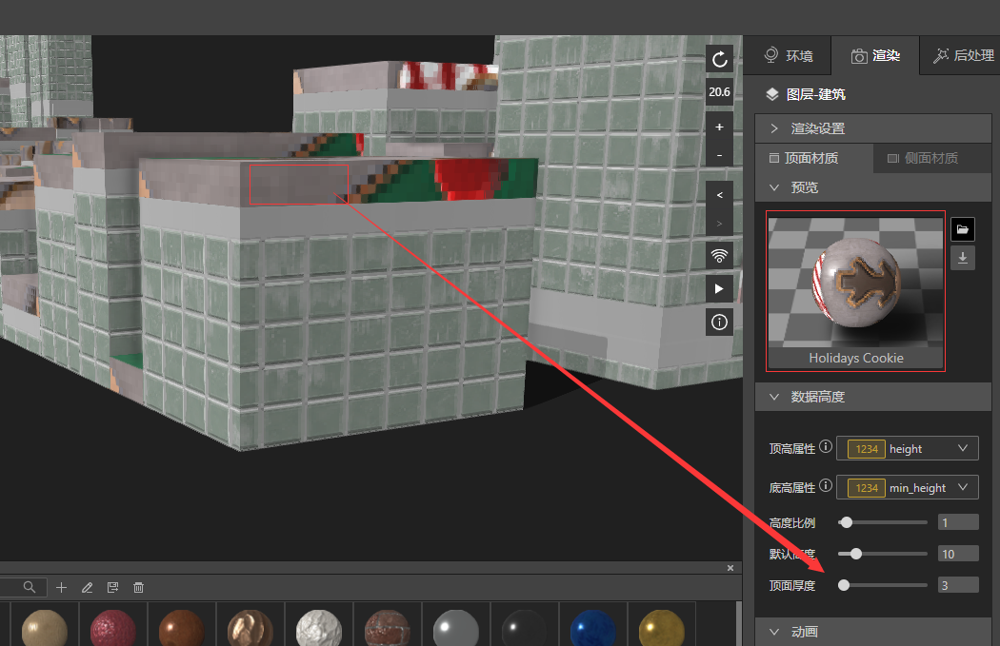
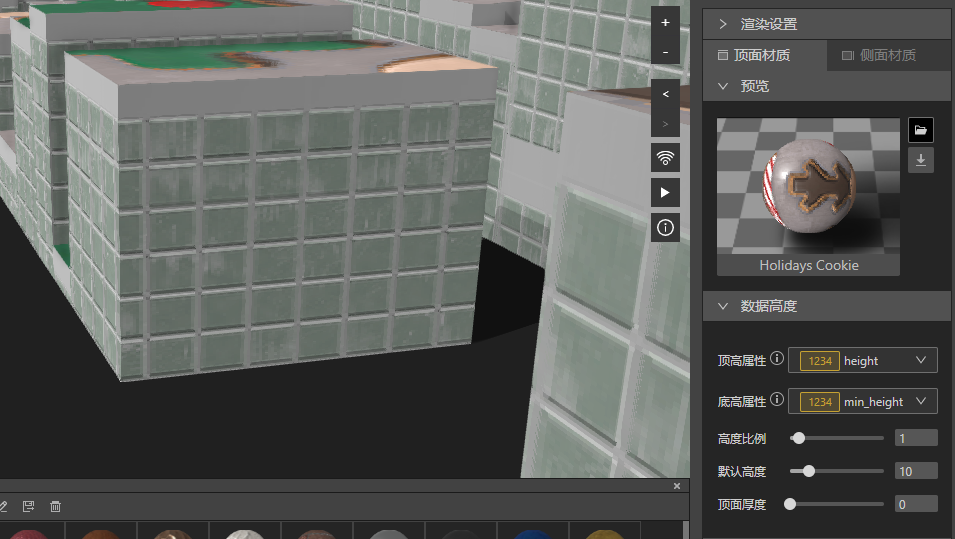
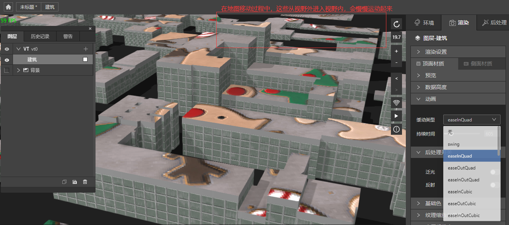
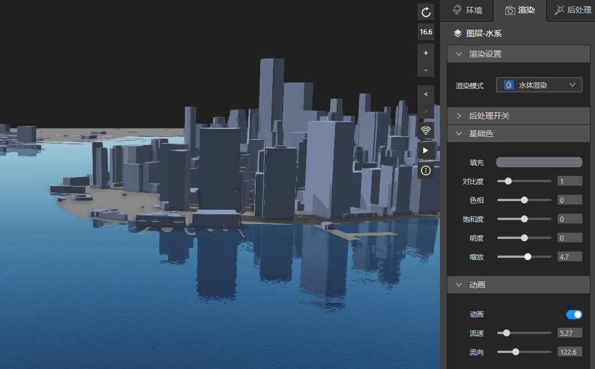
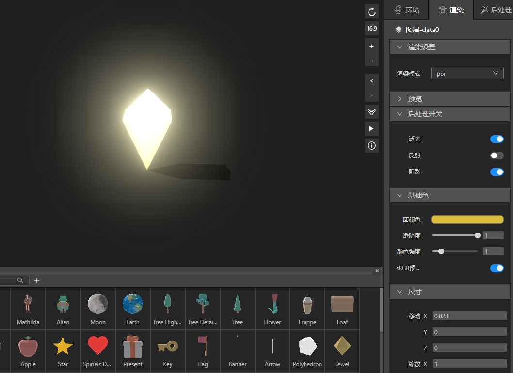
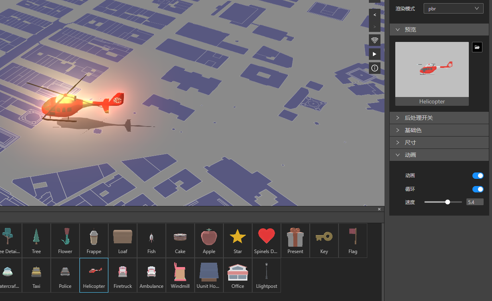
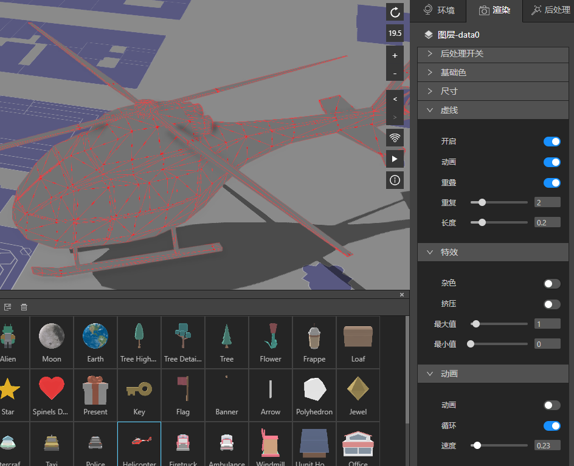
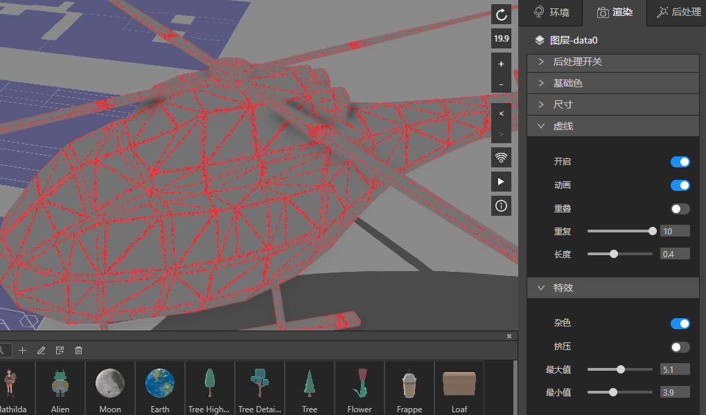

## 渲染模式

　　不同的图层数据，会有不同的渲染模式预设。

　　针对背景地面，我们提供了二维渲染，三维渲染。

　　针对vt图层，我们提供了二维渲染，三维渲染，水体渲染，可视化渲染和模型渲染尚在开发中。

　　针对geojson图层，再导入过程中，会区分点线面类型，然后针对不同类型，预设不同的渲染模式。比如，点数据，有二维渲染，可视化渲染；线数据，有二维渲染，三维渲染，可视化渲染；面数据，有二维渲染，三维渲染，水体渲染，可视化渲染。

　　针对gltf图层，我们提供了pbr和wireframe渲染。

　　针对点线面，我们针对每种特定的图层，直接预设了点线面不同的插件。比如点图层，能修改图标和文字；线图层，能修改基础色，图层线样式，文字；面图层能修改基础色，图层样式，图标，文字。

　　下面，我们对每种模式以及里头内置的属性做一一介绍。

## 二维渲染

　　二维渲染里面主要能调节面，线，文字，图标等。

　　在一个vt图层里面，我们以建筑和二级道路为例子。

*这是二级道路的设置面板， 我们在基础色面板里面设置填充，描边颜色，模式填充，模式间隔，动画速度，泛光，就能看到上图道路上有运动的光点了*

*这是二级道路的图标设置面板*

*这是建筑的设置面板*

　　因为建筑属于面数据，二级道路是线数据，在二维模式下，他们的设置面板会有所不同。不过这没有关系，相信您可以很快在页面上操作习惯。

　　通过改变基础色下的填充，能快速改变线或者面的颜色值。

　　在模式填充这块，您可以根据需要，填充不同的图片，可以做出各种各样的效果，比如我们找到一张沥青图片，上传并选中它，之后就能出现如下效果。

　　根据不同的图片，您可以做出各种不同的效果。

　　关于文字设置，有些图层是没有文字的，所以您设置了可能不能产生效果。由于数据的复杂性，我们无法提前预知哪些情况下文字是失效的，所以，只有当您设置它，不产生文字效果时，才知道此图层文字设置无效。

## 三维渲染

　　我们以vt建筑图层为例，我们为建筑选择三维渲染，并且打开“添加侧面”按钮，给顶面材质和侧面材质一一选择材质球，如下：

　　这里面主要有数据高度，动画，后处理和材质纹理的设置。后处理和材质请查看相应的篇章，我们在此处不做过多介绍。

　　在vt的建筑数据里头，一般会有height等属性，他用来标注建筑的高度，有些没有height的属性，我们会给个默认高度10，而对于有高度属性的数据，则通过高度比例，算出建筑的高度，再根据材质，绘制出相应的效果。

　　其中顶面厚度的更改的是顶面材质的高度，设置它会导致原本的高度不变，侧面材质高度会被挤压，效果如下：

　　设置动画，会在建筑要进入您的视野的时候，高度慢慢的上来。

## 水体渲染

　　我们在vt图层选择建筑和水系两个图层，建筑选择三维渲染模式，水系选择水体渲染模式。

　　将水系的后处理开关反射打开，可以看到建筑在水中的阴影。

　　调整水体的基础色参数，可以改变水体的颜色，缩放可以改变波纹大小。

　　动画流速流向影响波纹速度和方向。

## pbr

　　pbr作为模型图层的一种渲染方式，我们再导入一个模型后，打开泛光开关，调整面颜色，移动X。

　　这些基本操作您可以通过操作控件来了解其用法。

　　锁定尺寸，会保持模型在任何zoom级别一致的尺寸观看效果，一般情况下，我们关闭它，让模型随着zoom缩放产生近大远小的真实感。

　　动画会在模型有动画数据的时候才有效果，比如官方模型库里面的飞机模型。下方的飞机模型的螺旋会转动。

## wireframe

　　wireframe线框模式，效果如下。

　　虚线效果开启动画，虚线会移动。

特效效果如下。

## 可视化渲染（开发中）

## 模型渲染（开发中）

