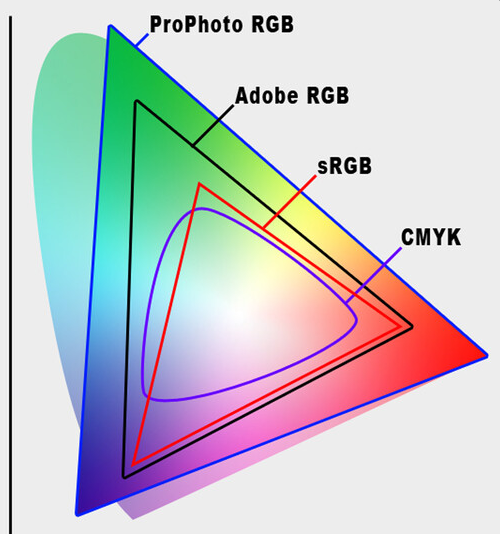
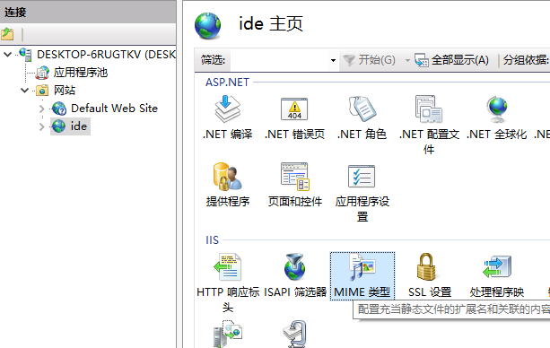
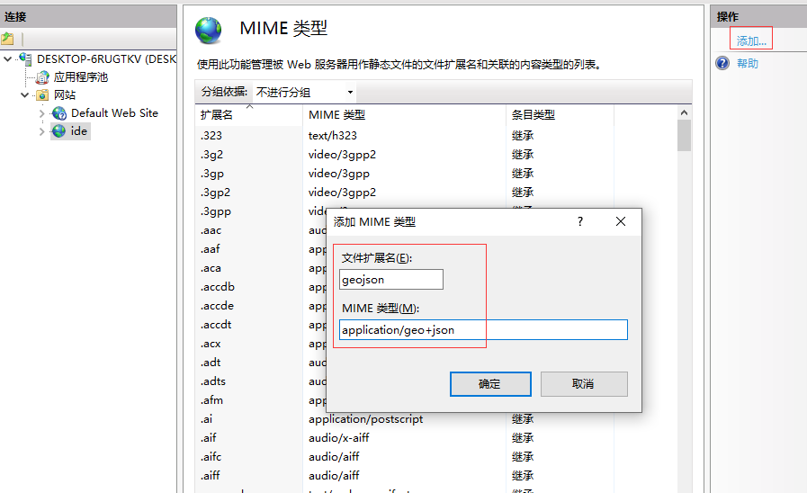
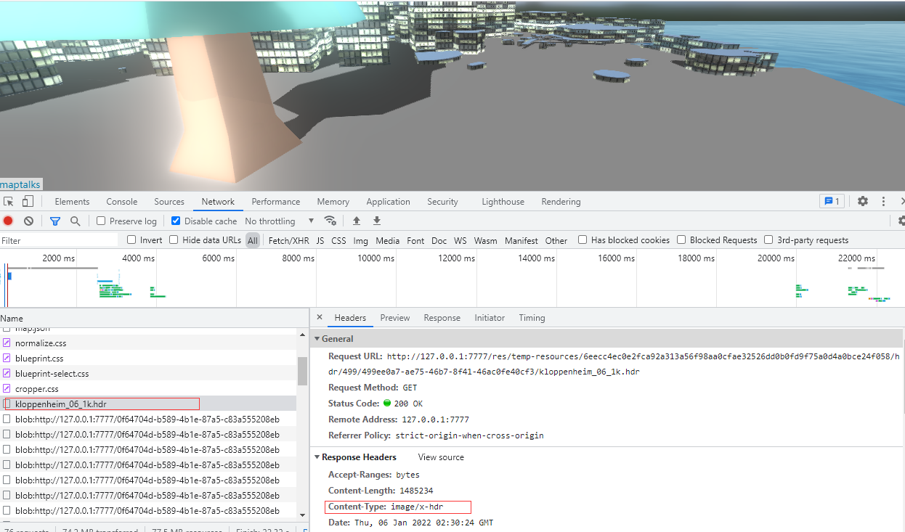

## FAQ

### 错误反馈

　　我们在 https://support.qq.com/products/324753 这个地址提供IDE反馈渠道，如果您有任何bug或者要求，请及时留言，我们会尽快处理。

　　请您尽可能的还原bug出现的步骤，如果有必要，可以在"帮助"菜单下，"打开日志文件夹"， 选中您最新发生错误的bug日志内容，在上述这个社区里，给我们留言，方便我们快速修复，您提供的复现bug信息越详细，越有助于我们快速修复这个问题，为了您的安全考虑，我们不会主动搜集您的任何信息，只能通过您主动上报的方式。

### 动画缓动类型

　　缓动函数指定参数随时间的变化率。

　　现实生活中的物体不仅会立即启动和停止，而且几乎不会以恒定速度移动。当我们打开抽屉时，我们首先快速移动它，然后在它出来时放慢速度。东西掉在地上，先加速向下，落地后又弹起来。


### sRGB

　　sRGB色彩空间（standard Red Green Blue，标准红绿蓝色彩空间）是惠普与微软于1996年一起开发的用于显示器、打印机以及因特网的一种标准RGB色彩空间。这种标准得到了W3C、Exif、英特尔、Pantone、Corel以及其它许多业界厂商的支持，在GIMP这样的开放源代码软件也支持这种标准，另外一些专有的或者象SVG这样的开放图形文件格式中也有应用。

　　sRGB最初设计的目的是作为生成在因特网以及万维网上浏览的图像的通用色彩空间，最后选择的是使用Gamma校准系数为2.2的色彩空间，即CRT显示器在这种情况下的平均线性电压响应。

　　这里值得重视的是sRGB的设计与当时（1996年）不算理想色彩空间的CRT显示器相匹配。当时大量的专业或者个人电脑软件，使用8位深度的图像文件，并且不经转换就在8位／通道的显示器上显示。许多时髦的非CRT硬件，如LCD、数字相机以及打印机，尽管本身并不生成sRGB曲线，但是都带有补偿电路或者软件以遵循这个标准。在一些高端的专业设备上可能并不遵循这个标准。因此，我们可以假定任何不带颜色配置表或者其它信息的8位图像文件、8位图像API或者设备接口，都处于sRGB色彩空间。

　　sRGB定义了红色、绿色与蓝色三原色的颜色，即在其它两种颜色值都为零时该颜色的最大值。在CIE xy颜色坐标系中红色位于[0.6400, 0.3300]、绿色位于[0.3000, 0.6000]、蓝色位于[0.1500, 0.0600]、白色是位于[0.3127,0.3290]的D65。对于任何的RGB色彩空间来说，非负的R、G、B都不可能表示超出原色定义的三角形即色域范围，它刚好在人眼的色彩感知范围之内。

　　sRGB还定义了原色强度与实际保存的数值之间的非线性变换。这个曲线类似于CRT显示器的gamma响应。重现这条曲线要比sRGB图像在显示器上正确显示更加重要。这个非线性变换意味着sRGB非常高效地使图像文件中的整数值表示了人眼可以分辨的颜色。


*sRGB和其他色系色域关系*

　　在IDE三维渲染中，开启sRGB和不开启是这样的效果。


### 纹理与材质的关系

　　材质，本质是数据集，表现物体对光的交互，供渲染器读取的数据集，包括贴图纹理，光照算法。

　　纹理贴图，本质是图像映射规则，是把存储在内存里的位图，通过UV坐标映射到渲染物体的表面。

　　材质在我们的数据组织里，有如下属性。
```
{
  "baseColorTexture": "{root}/baseColor.png",
  "baseColorFactor": [
    0.2235294117647059, 0.2235294117647059, 0.2235294117647059, 1
  ],
  "hsv": [0, 0, 0.06],
  "baseColorIntensity": 1,
  "contrast": 2.11,
  "outputSRGB": 1,
  "metallicRoughnessTexture": "{root}/metallicRoughness.png",
  "roughnessFactor": 0.4,
  "metallicFactor": 0,
  "normalTexture": null,
  "uvScale": [0.07407407407407408, 0.05],
  "uvOffset": [0, 0],
  "uvRotation": 0,
  "normalMapFactor": 1,
  "normalMapFlipY": 0,
  "bumpTexture": null,
  "bumpScale": 0.02,
  "clearCoatThickness": 5,
  "clearCoatFactor": 0,
  "clearCoatIor": 1.4,
  "clearCoatRoughnessFactor": 0.04,
  "occlusionTexture": null,
  "emissiveTexture": "{root}/渐变.jpg",
  "emissiveFactor": [0, 0, 0],
  "emitColorFactor": 1,
  "emitMultiplicative": 0,
  "albedoPBRFactor": 1.05,
  "outputLinear": 0,
  "clearCoatF0": 0.04,
  "polygonOpacity": 1,
  "emitColor": [1, 1, 1]
}
```

　　纹理如下，在IDE材质默认模式中，金属粗糙度纹理是由金属度纹理和粗糙度纹理合成的。
```
  baseColorTexture: '基础色纹理',
  bumpTexture: '高度纹理',
  emissiveTexture: '自发光纹理',
  metallicRoughnessTexture: '金属粗糙度纹理',
  normalTexture: '法线纹理',
  occlusionTexture: '环境光遮蔽纹理',
```

### 法线、高度、环境光遮蔽等纹理的使用建议及效果区别,材质使用技巧

TODO


### 设计成果发布注意事项

　　如果您采用IIS发布您的设计成果，需要修改MIME，如果不设置，下列资源是无法被加载的。

```
hdr image/x-hdr
gltf model/gltf+json
glb model/gltf-binary
bin application/octet-stream
webp images/webp
geojson application/geo+json
```

　　方法如下。

　　打开IIS, 在右侧找到MIME类型。



　　双击进入MIME页面，右侧有个添加按钮，点击它，添加上诉MIME。



　　最终，打开的静态页面就能看到相应类型的资源能被加载。


