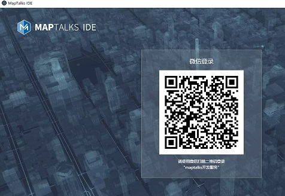
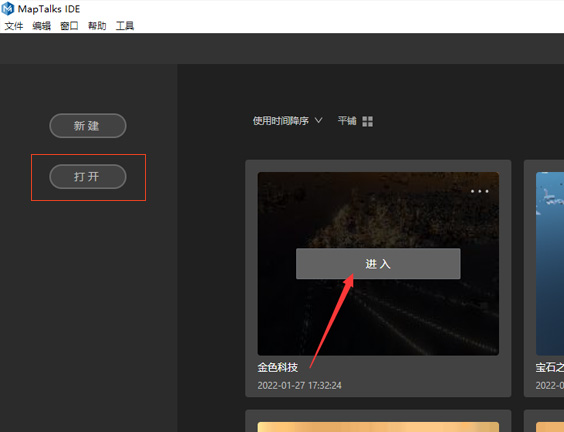
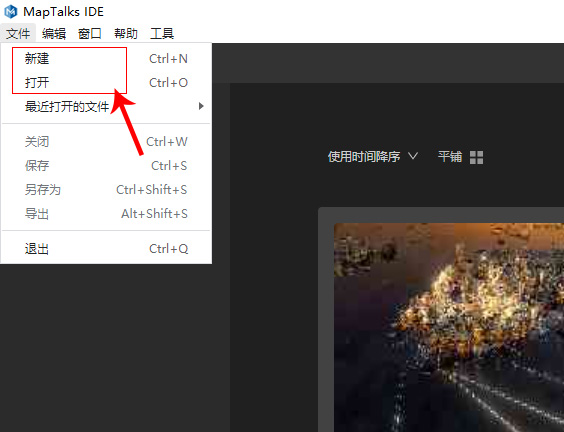
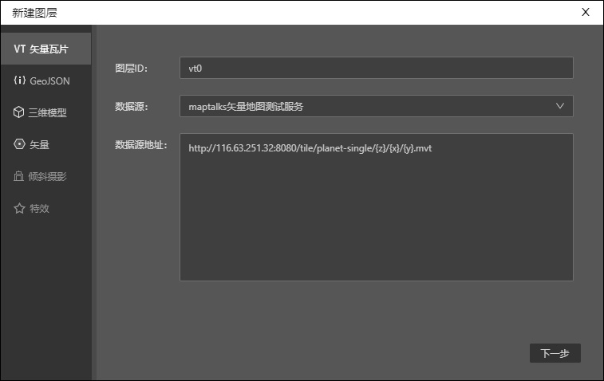
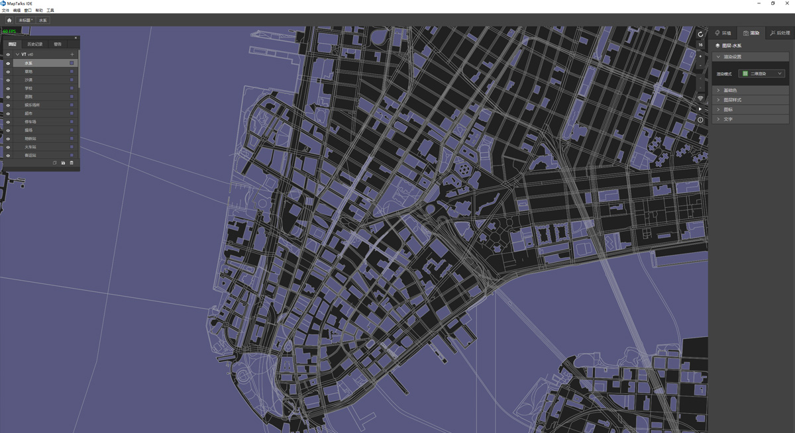

### 1. 扫码登录

新用户使用 MapTalks IDE 无需注册，启动 IDE 后，用微信扫描二维码就能登录使用。

用户登录后，IDE会把登录数据缓存在系统里，下次启动时会自动登录并在每次成功登录后更新登录数据。如果长时间未登录，登录数据过期后不再自动登录，此时只需再次用微信扫描二维码重新登录即可。

### 2. 打开工程文件

* 进入IDE后，点击左侧打开按钮，从本地直接打开工程文件，或者在右侧展示区中选择缩略图，单击“进入”。

* 所选的文件将会在IDE工作区打开

### 3. 创建工程文件

* 进入IDE后，点击新建按钮，创建工程。
* 或者在顶部的菜单中单击文件，选择新建。

* IDE提供了新建图层面板，可以提前预设矢量图层、Geojson、三维模型、矢量图层各种属性。
(ps:倾斜摄影和特效图层正在加紧施工中，会在下个版本更新)

* 这里我们可以选择VT矢量图层，其他属性不变，单击下一步，全选数据，单击确认。

* 此时VT数据将会出现在工作区，完成创建工作。

