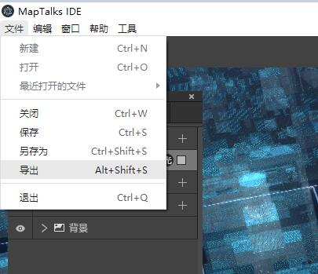

IDE的设计成果最终是服务于web前端程序的，导出的数据能在前端javascript程序中根据需要加载MSD中的样式或数据。

要在程序中调用IDE的设计成果，只需如下两步：

## 导出msd JSON数据

用IDE打开某个msd文件后，在文件菜单中选择`导出`即可导出msd JSON数据。



导出的文件如下：


文件说明：
```
    +- js           (预览页面中用到的 js 程序)
    +- res          (资源文件，如纹理图片，GLTF模型等
    +- styles       (预览页面中用到的css样式表)
    +- index.html   (map.json的预览页面)    
    +- map.json     (JSON格式的样式文件)    
```

## 在程序中载入

* 安装 MSDJSONLoader 开源库，详细接口可以参考 [MSDJSONLoader](https://github.com/maptalks/MSDJSONLoader)中的接口说明

```
npm i @maptalks/msdjsonloader
```

* 在应用程序中调用。

以下为一个简单的加载IDE中某个图层样式的示例。

你也可以根据需要选择加载整个地图的样式或者某个图层的数据或样式，更丰富的用法请参考[使用示例](https://maptalks.com)。

```js
    import MSDJSONLoader from '@maptalks/msdjsonloader';
    
    const loader = MSDJSONLoader({
        data: 'path/to/map.json'
    });
    await loader.load();
    // 获得MSD中 geojson0 图层的样式
    const layer = loader.getLayer('geojson0');
    const style = layer.getStyle();
    // 把样式设置给应用中的geojson图层
    map.getLayer('group').getLayer('geojson').setStyle(style);
    
```

