## 制作泛光材质球

夜景中最迷人的万家灯火，交相辉映，studio有许多内置的材质球可以轻松实现建筑物泛光效果，但我们也可以用很简单的方法制作自己的泛光材质球，让我们开始吧。

### 1、准备好建筑物

* 启动Studio，新建一个文件，新建VT图层，VT图层里添加建筑数据。

* 在渲染设置中将建筑数据从二维渲染切换到三维渲染。

* 我们先赋予建筑任意一个材质球，这里我们选择石头类材质，然后在环境面板中选取一个夜景的HDR。

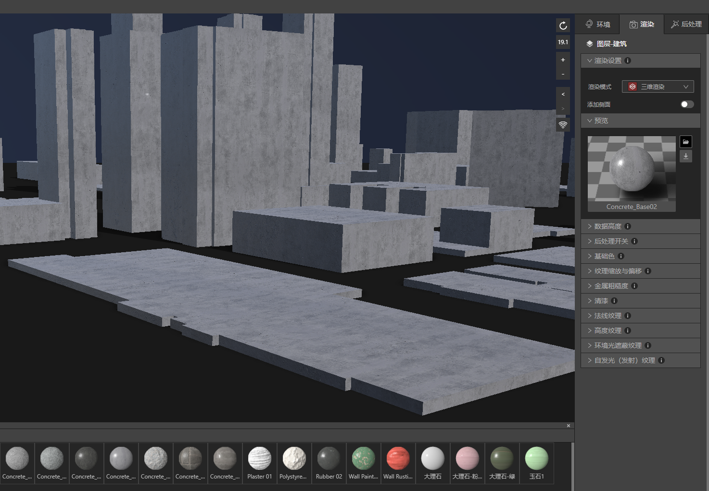

* 文件准备就绪，让我们进入下一步。

### 2、在photoshop中制作一张自发光纹理的图片

* 打开Photoshop，新建一张512x512px,分辨率72的文件。

* 将底色填充成黑色，黑色代表不发光的部位，然后我们在上面任意画几个白色的方框，白色代表希望发光的部位，方框的尺寸、间距都可以根据你自己想要的最终效果自定义，我们这里简单画成长条形。

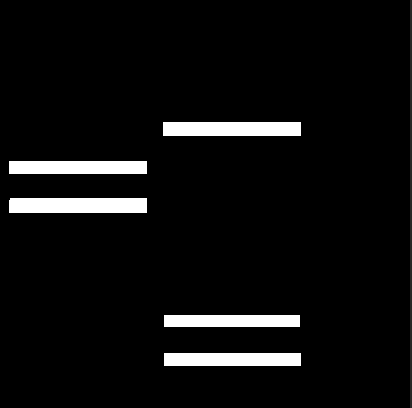

* 保存图片，命名为1.jpg，自发光纹理文件准备就绪，让我们进入下一步。

### 3、在渲染面板中添加自发光纹理图片

* 回到studio，选中建筑图层，在渲染面板最下面的“自发光（发射）纹理”面板中，单击纹理选项旁边的小图标，打开纹理管理面板。

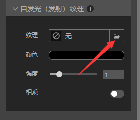

* 纹理管理面板中导入刚才做好的窗户文件1.jpg，然后关掉面板。

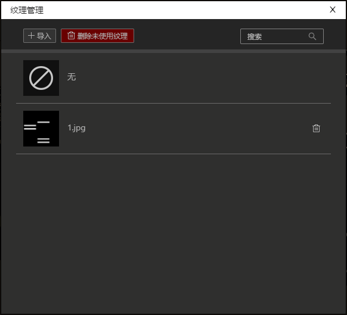

* 回到“自发光（发射）纹理”面板中，单击纹理框，在弹出的下拉菜单中，选中1.jpg。

* 此时建筑物变成白色，不用担心，我们开始重新设置自发光的设置。

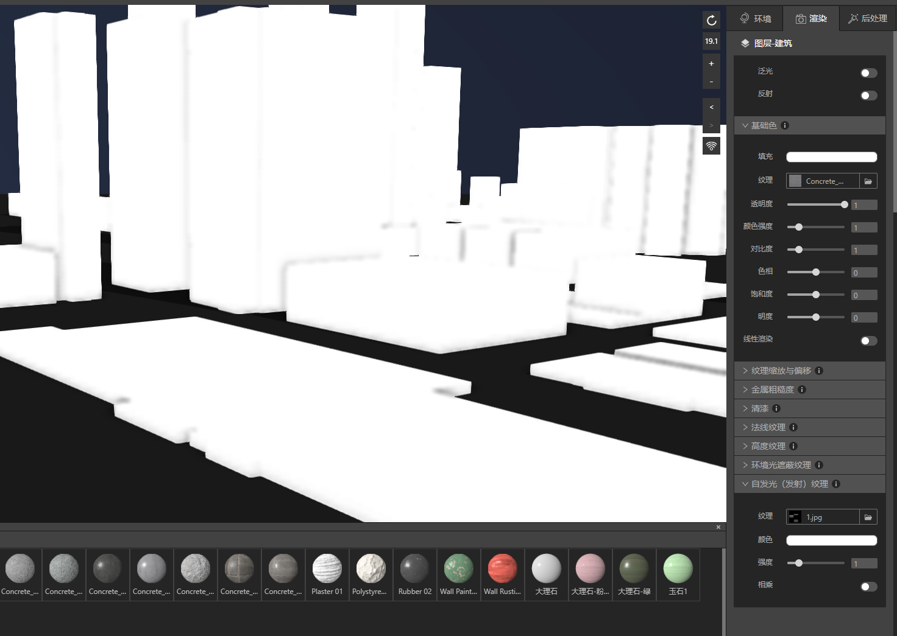

　　1. 将渲染面板中的后处理开关“泛光”按钮开启。此时图层面板上建筑图层右边会出现“光”图标，代表该图层泛光按钮是开启状态。

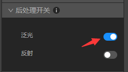
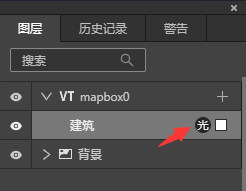

　　2. 将自发光（反射）纹理面板中的颜色变成黑色000000。这里的颜色和自发光纹理图片是相加的关系，颜色越白自发光纹理图片就会越浅越亮，颜色越深纹理图片就会越深越暗。   

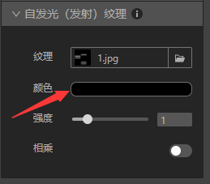

　　3. 选择“后处理”，打开“泛光”面板，将最小阈值从0改成0.95，强度因子从1改成0.4，泛光半径从1改成0.083。

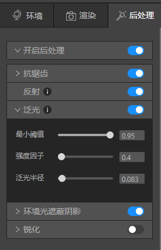

* 经过上述3个步骤，现在我们可以看看最终效果了，是不是还不错？

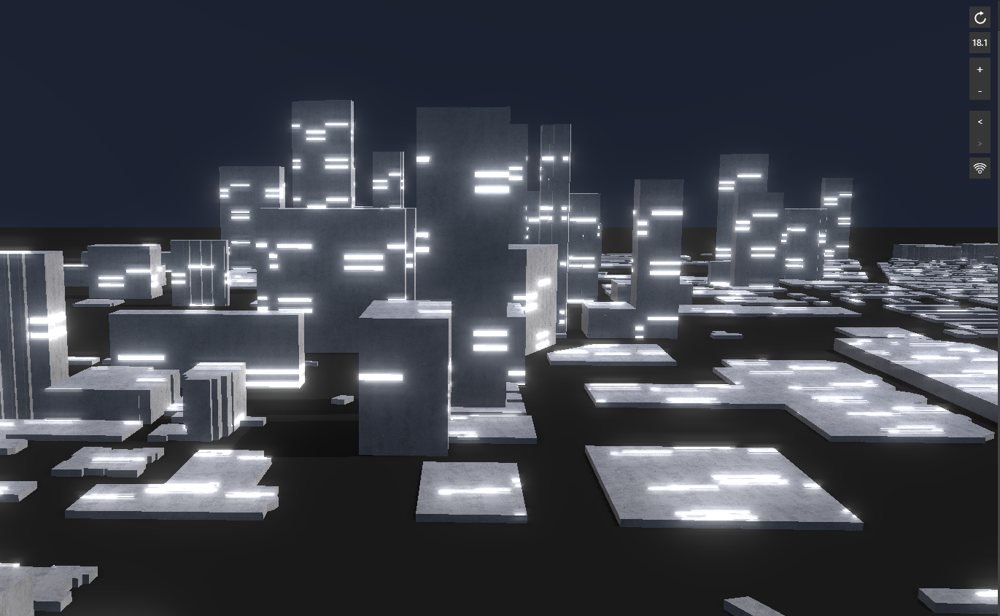

### 4、另存为材质球

* 辛苦做好的材质球可以保存在材质库里，这样就可以反复使用了。我们回到“渲染”面板下的“预览”，单击材质球预览图右边第二个图标 ，选择“另存为材质”。

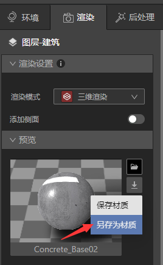

* 在弹出的另存为面板里填写新材质球的名字和保存类目。

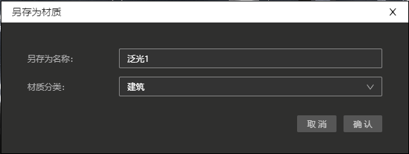

* 然后在材质库建筑分类下，你就可以找到刚刚存好的材质球“泛光1”，以后就可以反复使用这个新材质球了，是不是很方便呢：）

