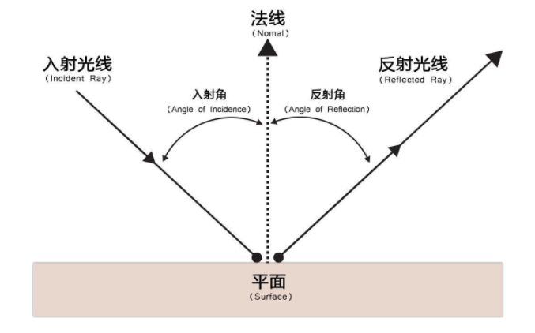
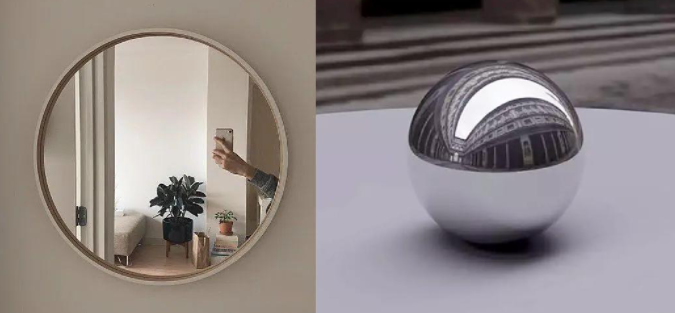
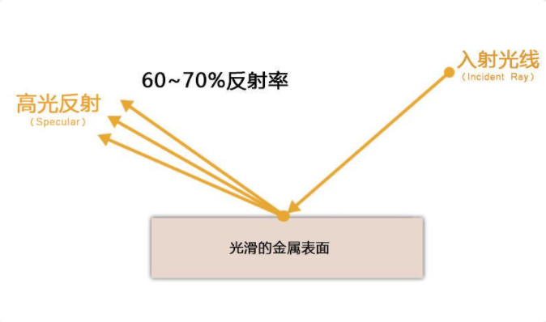
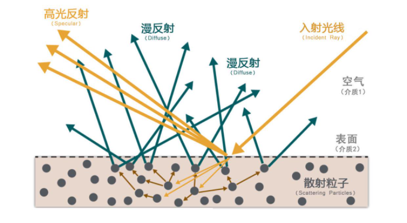
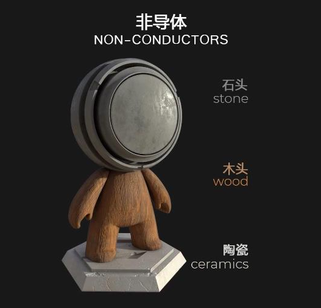
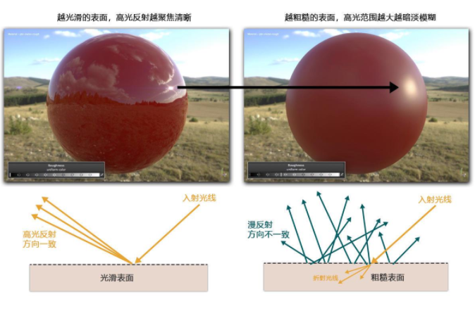
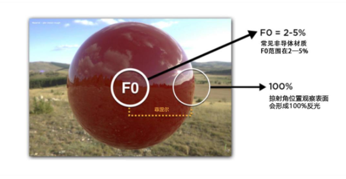

# 什么是 PBR?　　

&emsp;&emsp;在studio 软件中，我们运用了一种叫做 PBR 的技术，PBR（Physically Based Rendering）是一种基于物理的着色和渲染技术。但它到底是什么呢？

　　早期创造 3 维场景中，我们会选择各种材质球或者纹理图片，比如金属、砖墙，去表现真实世界物体的质感和颜色，当你好不容易做了大量的调试，设置各种参数让模型看起来像真正的金属、砖墙，结果导入到不同的三维软件后，即使是同样的模型和贴图，因为不同的光照方案，着色器设置等，看起来会完全不一样。

　　为了解决这些问题，业界开展了大量的研究，迪士尼动画工作室在 SIGGRAPH 2012 上著名的 talk《Physically-based shading at Disney》中提出了迪士尼原则的 BRDF(Disney Principled BRDF），在电影和游戏业界引起了不小的轰动。从此，基于物理的渲染正式进入大众的视野，也奠定了 PBR 的方向和标准。

　　无需进行复杂的设置，只需要设置少数的纹理贴图，并根据现实世界中的材质属性输入参数，不管在什么光照场景和软件中，都可以做出正确的材质质感，简单说，在 PBR 工作流中，我们可以用非常直观的少量变量去表达材质复杂的物理属性。这是如何做到的呢？如果你想深入学习蕴含其中的物理规律，我们建议你可以阅读由 Substance 官方推出的《The PBR Guide》，这本手册由 3D 领域各路专家共同编制，从理论到实践，深度解析 PBR 的工作原理。但现在，抛开难懂的技术术语，对于使用 studio 的艺术家们来说它意味着什么呢？让我们提纲挈领，简要介绍一下关于 PBR 的知识。

## 1、所有物体或多或少都会反射光线

  

　　不管是闪亮的金属，还是半透明的塑料，甚至一件衣服，它们都会反射光线。有些介质，比如镜子或者光滑的金属，如下图，实际上你看到的周边环境远多于它自身的材质，这是因为照射在它上面的光线大部分完美反射到你的眼睛里。

  

*镜子和光滑的金属球*  

　　而有些介质，光线照射到表面时会穿透到内部，光线会在介质内部撞击不同的散射粒子，并被多次散射，然后再重新折射穿出这个物体。        因此不同于金属介质完美的反射光线，我们眼中接收的是一团混乱方向的反射光线，也就是漫反射，再基于物体本身的材质和光线的入射波长，就让我们看到了材质本身的颜色。

  

*非金属的砖墙和石头*  

## 2 、材质不是金属就是非金属

　　金属具有导电性，也被叫做导体。光照到金属时，光线大部分会被反射，被抛光过的金属的反射值在 70%-100%之间，而所有的折射光都会被吸收。

　　非金属是较差的电导体，也叫做非导体，比如石头、陶瓷、木头等。材质内被折射的光一般会被散射或者同时被吸收（通常会穿透物体二次折射）

## 3、物体越粗糙，反射高光越模糊

　　如果物体是不规则的平面，因为接触面的粗糙度，光线反射的方向会变得非常随机。越粗糙的表面，它的高光范围会越大，表现也越暗。

## 4、物体越光滑，反射高光越清晰

　　如果物体是规则完美的平面，光线反射的方向也会非常完美一致，同时高光更聚焦，在特定的角度下观看，高光会更亮更强。

## 5、菲涅尔系数

　　菲列尔系数是用法国物理学家 Augustin-Jean Fresnel 名字命名的，他发现用更斜的角度去观察水面，并慢慢与水面趋于平行时，能看见越来越多的高光反射。F0（菲涅尔零点）是指使用介质表面的折射率（IOR）导出折射的光线量。

## 结束语

　　在 PBR 世界中已制定好各种规则，你并不需要掌握复杂的方程式就可以自如创造真实世界的材质，以上就是我们关于 PBR 的简单介绍，希望这篇文章能起到抛砖引玉的作用。
